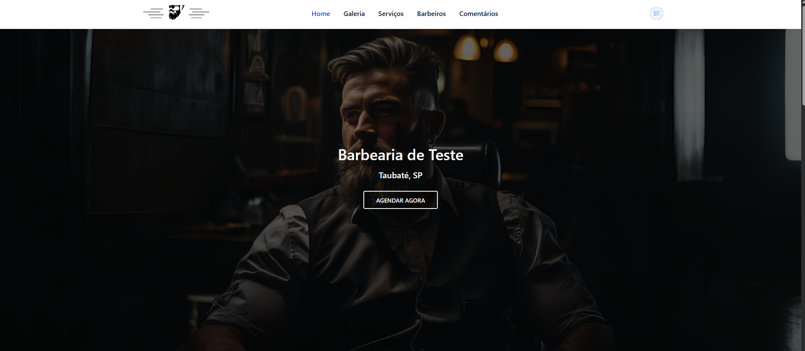

💈 BarberConnect — Sistema de Agendamento para Barbearias

  

🚀 Sobre o Projeto

O BarberHub é uma aplicação web desenvolvida para facilitar o dia a dia de barbearias, substituindo agendas físicas por um sistema digital moderno.

Com ele, clientes podem agendar horários facilmente e barbeiros conseguem organizar sua rotina de forma eficiente.

✂️ Funcionalidades
📅 Agendamento online de horários
👤 Cadastro de clientes
💈 Gestão de barbeiros
🧾 Controle de serviços (corte, barba, etc.)
⏰ Controle de horários disponíveis
📊 Painel administrativo
🔔 (Opcional) Notificações de agendamento
🛠️ Tecnologias Utilizadas
PHP com Laravel
MySQL ou PostgreSQL
Blade / Livewire
TailwindCSS
JavaScript
⚙️ Instalação

Siga os passos abaixo para rodar o projeto localmente:

# Clonar o repositório
git clone https://github.com/gabrielscosta447/barbearia-agendamento.git

# Acessar a pasta
cd barbearia-agendamento

# Instalar dependências
composer install
npm install

# Copiar o .env
cp .env.example .env

# Gerar chave da aplicação
php artisan key:generate

# Rodar migrations
php artisan migrate

# Iniciar servidor
php artisan serve
🔑 Configuração

Configure seu arquivo .env com as informações do banco de dados:

DB_DATABASE=barberhub
DB_USERNAME=root
DB_PASSWORD=
## 📸 Preview

🎯 Objetivo

Este projeto tem como objetivo:

Melhorar a organização de barbearias
Reduzir faltas de clientes
Automatizar agendamentos
Oferecer uma experiência moderna para clientes
📌 Futuras Melhorias
💳 Integração com pagamentos online
📱 Versão mobile (app)
📲 Integração com WhatsApp
⭐ Sistema de avaliações
🤝 Contribuição

Sinta-se à vontade para contribuir com o projeto:

# Criar uma branch
git checkout -b minha-feature

# Commit
git commit -m "Minha nova feature"

# Push
git push origin minha-feature
📄 Licença

Este projeto está sob a licença MIT.

👨‍💻 Autor

Desenvolvido por Gabriel 🚀
